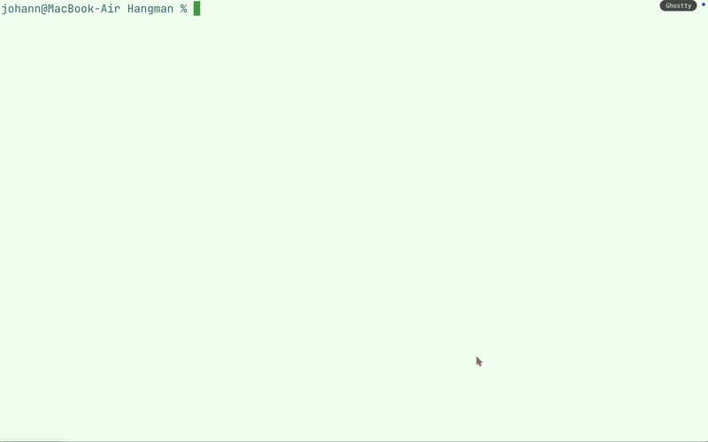

# Hangman

Hangman is a guessing game for two or more players. One player thinks of a word, phrase, or sentence and the other tries to guess it by suggesting letters or numbers within a certain number of guesses.

## Features

- CLI
- Ascii art
- Save/Load current game session
## Demo


## FAQ

#### How to choose difficulty

When starting or restarting a game, you can choose the difficulty. It affects the amount of attempts (lives / hearts) you have.

#### How to guess a word

You can guess a word by typing in a letter each time you get prompted about it (right after choosing the difficulty). It will run until you guess the word, or run out of attempts.

#### How to save

You can save the current game state if you input "save" when asked about entering new Letter.
The game gets saved to the "Hangman/saves" directory as a number without file extension.

You can load at the beginning of each new game or each time you retry a game.
Just write "y" when you get promted about it.
#### How to load

## Run Locally

Clone the project

```bash
  git clone https://github.com/its-namami/Hangman
```

Go to the project root directory

```bash
  cd Hangman
```

Start the game

```bash
  ruby main.rb
```
